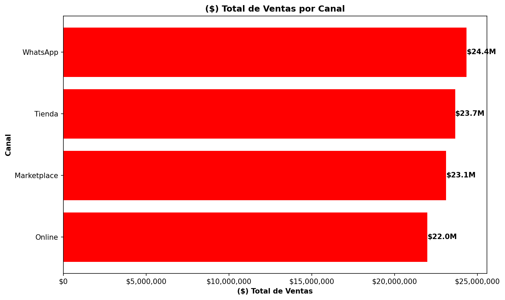
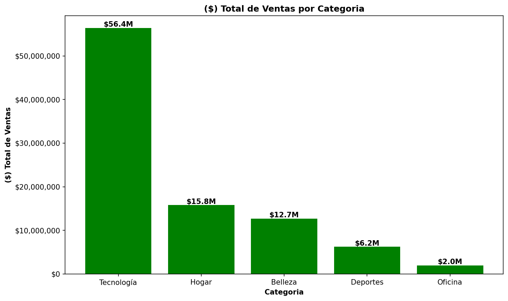
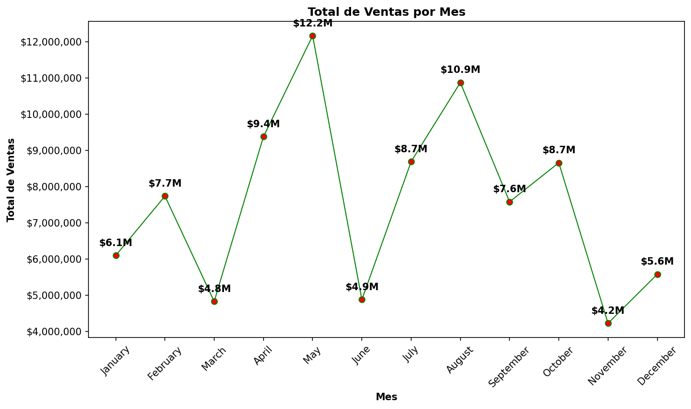
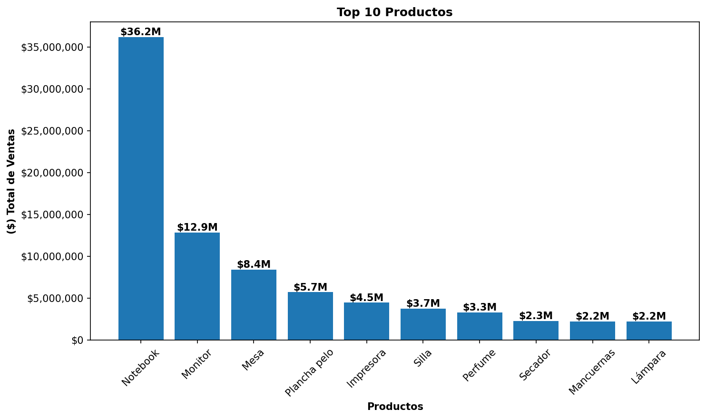

# Ventas-Python — EDA y Limpieza de Datos

> Python · pandas · numpy · matplotlib · Google Colab

---

## 🛠️ Stack Tecnológico

| Herramienta / Librería | Uso en el proyecto |
|---|---|
| Python 3 | Lenguaje principal |
| pandas | Carga, exploración y limpieza del dataset |
| numpy | Manejo de valores nulos y condiciones numéricas |
| matplotlib | Generación de visualizaciones |
| Google Colab | Entorno de desarrollo (notebook interactivo) |

---

## 🎯 Objetivo

Realizar un análisis exploratorio (EDA) y proceso de limpieza de datos sobre un dataset de ventas comerciales, identificando y corrigiendo errores de calidad en múltiples columnas sin perder información innecesariamente. Como criterio central, los registros con datos faltantes se mantienen en el dataset usando etiquetas descriptivas en lugar de eliminar filas. Como resultado final se generan visualizaciones que permiten extraer hallazgos clave del negocio.

> Los datos utilizados son ficticios / simulados con fines de aprendizaje.

---

## 📁 Estructura del Repositorio

```
📦 Ventas-Python/
├── 📓 Proyecto_2.ipynb                    ← Notebook principal con EDA, limpieza y visualizaciones
├── 📂 dataset/
│   └── Datos_Proyecto_Intermedio.xlsx     ← Dataset fuente
├── 📂 screenshots/
│   └── ventas_canal.png
│   └── ventas_categoria.png
│   └── ventas_mes.png
│   └── top10_productos.png
└── 📄 README.md
```

---

## 📦 Dataset

| Columna | Tipo original | Tipo final | Descripción |
|---|---|---|---|
| ID_Venta | str | str | Identificador único de cada venta |
| Fecha | object | datetime64 | Fecha de la venta |
| Sucursal | str | str | Sucursal donde se realizó la venta |
| Categoría | str | str | Categoría del producto |
| Producto | str | str | Nombre del producto vendido |
| Canal | str | str | Canal de venta (Tienda, Online, WhatsApp, Marketplace) |
| Vendedor | str | str | Nombre del vendedor responsable |
| Cliente_ID | str | str | Identificador del cliente |
| Unidades | int | float | Cantidad de unidades vendidas |
| Precio_Unitario | object | float | Precio por unidad (presentaba errores de formato) |
| Descuento | object | float | Porcentaje de descuento aplicado |
| Costo_Unitario | int | int | Costo unitario del producto |
| Metodo_Pago | str | str | Método de pago utilizado |
| Estado_Entrega | str | str | Estado de la entrega (Entregado, Pendiente, Cancelado, Devuelto) |
| Total_Venta | int | float | Total de la venta: `Precio_Unitario * Unidades * (1 - Descuento / 100)` |

**Dimensiones:** 650 filas × 15 columnas

---

## 🔍 EDA — Exploración Inicial

La exploración se realizó con `.shape`, `.info()`, `.describe()`, `.isnull().sum()` y `.value_counts()`, identificando los siguientes problemas por columna:

| Columna | Dtype original | Problema detectado |
|---|---|---|
| Fecha | object | 1 nulo + 5 fechas inválidas (imposibles o en texto: `31/02/2024`, `sin fecha`, `15-15-2024`) |
| Categoría | str | 1 nulo + 4 errores de escritura (`BELLEZA`, `Tecno`, `Deporte`, `Oficna`) |
| Producto | str | 2 nulos |
| Canal | str | 1 nulo + 5 errores de escritura (`TIENDA`, `On line`, `Whatsapp`, `Market place`, `online`) |
| Vendedor | str | 3 nulos |
| Precio_Unitario | object | 3 nulos + formato con `$` y `.` (`$58.700`) + texto inválido (`precio pendiente`) + 7 valores `= 1` + 1 outlier (`9.999.999`) |
| Descuento | object | Valores con símbolo `%` (`10%`) + valores fuera de rango (`80`, `-5`) |
| Unidades | int | 6 valores negativos |
| Metodo_Pago | str | 1 nulo |
| Total_Venta | int | 11 filas con valor incorrecto (no coinciden con la fórmula definida) |

---

## 🧹 Limpieza de Datos

### Criterios aplicados

| Columna | Problema | Criterio aplicado |
|---|---|---|
| Categoría | Errores de escritura | `.replace()` con diccionario de mapeo |
| Categoría | Nulos | `.fillna("Sin categoría")` |
| Canal | Errores de escritura | `.replace()` con diccionario de mapeo |
| Canal | Nulos | `.fillna("Sin canal")` |
| Producto | Nulos | `.fillna("Sin producto")` |
| Vendedor | Nulos | `.fillna("Sin vendedor")` |
| Metodo_Pago | Nulos | `.fillna("Sin método de pago")` |
| Precio_Unitario | Formato `$` y `.` separador de miles | `.astype(str)` + `.str.replace()` encadenado |
| Precio_Unitario | Texto inválido (`precio pendiente`) y nulos | `pd.to_numeric(errors='coerce')` → NaN |
| Precio_Unitario | Valores `= 1` (error de digitación) | `.loc[]` con condición → NaN |
| Precio_Unitario | Outlier (`9.999.999`) | `.loc[]` con condición → NaN |
| Descuento | Símbolo `%` | `.astype(str)` + `.str.replace()` |
| Descuento | Valores fuera de rango (`< 0` o `>= 80`) | `np.where()` con condición → NaN |
| Unidades | Valores negativos | `.loc[]` con condición → NaN |
| Fecha | Fechas inválidas o imposibles | `pd.to_datetime(errors='coerce')` → NaT |
| Total_Venta | 11 filas con valor incorrecto | Recálculo con fórmula + `.loc[]` para corregir solo errores reales |

> Las ventas con `Estado_Entrega = Cancelado` o `Devuelto` y `Total_Venta = 0` se consideran correctas desde el punto de vista del negocio y no se modifican.

### Ejemplos de código clave

**Corrección de errores de escritura con diccionario de mapeo:**
```python
dic_categoria = {"BELLEZA": "Belleza", "Tecno": "Tecnología", "Deporte": "Deportes", "Oficna": "Oficina"}
df["Categoría"] = df["Categoría"].replace(dic_categoria)
df["Categoría"] = df["Categoría"].fillna("Sin categoría")
```

**Limpieza de columna numérica con formato mixto (object + str + número):**
```python
df["Precio_Unitario"] = df["Precio_Unitario"].astype(str)
df["Precio_Unitario"] = df["Precio_Unitario"].str.replace("$", "", regex=False).str.replace(".", "", regex=False)
df["Precio_Unitario"] = pd.to_numeric(df["Precio_Unitario"], errors="coerce")
```

**Invalidación de valores fuera de rango con `np.where()`:**
```python
df["Descuento"] = df["Descuento"].astype(str).str.replace("%", "", regex=False)
df["Descuento"] = pd.to_numeric(df["Descuento"], errors="coerce")
df["Descuento"] = np.where((df["Descuento"] < 0) | (df["Descuento"] >= 80), np.nan, df["Descuento"])
```

**Validación y corrección de `Total_Venta` con fórmula:**
```python
df["Total_Calculado"] = df["Precio_Unitario"] * df["Unidades"] * (1 - df["Descuento"] / 100)
df["Total_Inconsistencias"] = (
    df["Precio_Unitario"].notna() & df["Unidades"].notna() & df["Descuento"].notna()
    & (df["Total_Calculado"].round() != df["Total_Venta"].round())
)
condicion = df["Total_Inconsistencias"] & ~df["Estado_Entrega"].isin(["Cancelado", "Devuelto"])
df.loc[condicion, "Total_Venta"] = df["Total_Calculado"]
```

---

## 📊 Visualizaciones

> Los gráficos fueron exportados directamente desde matplotlib con `plt.savefig(dpi=150, bbox_inches="tight")` para garantizar alta resolución.

Se generaron 4 gráficos excluyendo registros con etiquetas vacías (`Sin categoría`, `Sin producto`, `Sin canal`) para no distorsionar el análisis visual.

| Gráfico | Tipo | Variable analizada | Hallazgo principal |
|---|---|---|---|
| Ventas por Canal | Barras horizontales | Canal vs Total_Venta | **WhatsApp** es el canal con mayor volumen de ventas |
| Ventas por Categoría | Barras verticales | Categoría vs Total_Venta | **Tecnología** es la categoría líder en ventas |
| Ventas por Mes | Línea de tendencia | Mes vs Total_Venta | **Mayo** registró el mayor pico de ventas del año |
| Top 10 Productos | Barras verticales | Producto vs Total_Venta | **Notebook** es el producto más vendido |






---

## ⚙️ Técnicas Python Aplicadas

- Copia de seguridad del DataFrame original con `.copy()` antes de iniciar la limpieza
- Exploración inicial con `.shape`, `.info()`, `.describe()`, `.isnull().sum()`, `.value_counts()`
- Corrección de errores de escritura con `.replace()` usando diccionarios de mapeo
- Manejo de nulos en columnas de texto con `.fillna()` usando etiquetas descriptivas
- Conversión de columnas mixtas (`object`) a string con `.astype(str)` antes de limpiar con `.str`
- Limpieza de caracteres especiales con `.str.replace()` encadenado (`$`, `.`, `%`)
- Conversión a numérico con `pd.to_numeric(errors='coerce')` para manejar texto inválido
- Invalidación de valores fuera de rango con `np.where()` y condiciones booleanas
- Filtrado y asignación condicional con `.loc[]`
- Conversión de fechas con `pd.to_datetime(errors='coerce')` y manejo de `NaT`
- Extracción de componentes de fecha con `.dt.month` y `.dt.month_name()`
- Validación de columna calculada reconstruyendo la fórmula y comparando con `.round()`
- Separación de inconsistencias en grupos con `.isin()` y operador `~` de negación booleana
- Resolución de `SettingWithCopyWarning` aplicando `.copy()` al crear subconjuntos del DataFrame
- Agrupación y agregación con `.groupby()` + `.sum()` + `.reset_index()` + `.sort_values()`
- Visualizaciones con `plt.bar()`, `plt.barh()` y `plt.plot()` con `marker`
- Formato de ejes con `ticker.FuncFormatter` para evitar notación científica
- Etiquetas de valor sobre barras con `plt.bar_label()` en formato millones (`$xM`)
- Anotaciones sobre gráfico de línea con `plt.annotate()` en loop con `xytext` y `offset points`
- Exportación de gráficos en alta calidad con `plt.savefig()` usando `dpi=150` y `bbox_inches="tight"`

---

## 📋 Resultados & Hallazgos Clave

| Métrica | Valor |
|---|---|
| Total de registros analizados | 650 |
| Columnas con problemas de calidad | 10 de 15 |
| Errores de escritura corregidos (Categoría + Canal) | 9 valores |
| Fechas inválidas o imposibles | 6 registros → NaT |
| Precios inválidos detectados y neutralizados | 12 (7 con valor $1 + 1 outlier + 4 nulos originales) |
| Filas con `Total_Venta` incorrecto corregidas | 11 |
| Ventas canceladas o devueltas con `Total_Venta = 0` (correctas) | 103 |
| Canal con mayor volumen de ventas | WhatsApp |
| Categoría con mayor volumen de ventas | Tecnología |
| Mes con mayor pico de ventas | Mayo |
| Producto más vendido | Notebook |

---

## 🧠 Conclusiones y Aprendizajes

### Sobre la calidad de los datos
El dataset presentó múltiples tipos de errores simultáneos en la misma columna: nulos, formatos incorrectos, errores de escritura, valores fuera de rango y outliers. El criterio central de limpieza fue **no perder información innecesariamente** — los registros con datos faltantes se mantuvieron en el dataset usando etiquetas descriptivas (`Sin categoría`, `Sin producto`, `Sin canal`, etc.) en lugar de eliminar filas completas.

### Sobre el proceso de limpieza
La columna `Precio_Unitario` fue la más compleja del proyecto por combinar tres tipos de error distintos en una sola columna. El aprendizaje clave fue la importancia del **orden de operaciones**: en columnas de tipo mixto (`object`), es necesario convertir a `str` con `.astype(str)` antes de aplicar cualquier método `.str`, ya que los valores numéricos reales no responden a esos métodos y se convierten silenciosamente a `NaN`.

### Sobre la validación de columnas calculadas
La validación de `Total_Venta` demostró que no toda inconsistencia es un error — las ventas con estado `Cancelado` o `Devuelto` tienen `Total_Venta = 0` de forma intencional y correcta desde el negocio. Distinguir entre inconsistencias esperadas y errores reales requiere combinar lógica técnica con comprensión del dominio del negocio.

### Aprendizajes técnicos clave
- El `SettingWithCopyWarning` ocurre al modificar un subconjunto filtrado de un DataFrame; se resuelve añadiendo `.copy()` al crear el subconjunto
- `pd.to_numeric(errors='coerce')` convierte automáticamente el string `"nan"` a `NaN` real, eliminando la necesidad de un paso adicional
- En columnas `int`, insertar `NaN` convierte automáticamente el dtype a `float` — comportamiento esperado de numpy, no un error
- `plt.barh()` muestra el mayor valor abajo por defecto; ordenar el DataFrame de forma ascendente antes de graficar lo coloca arriba
- Para anotar puntos en un gráfico de línea, `plt.annotate()` en un loop con `zip()` es más flexible y controlable que `plt.bar_label()`

---

*Proyecto desarrollado como parte del portafolio de análisis de datos.*
